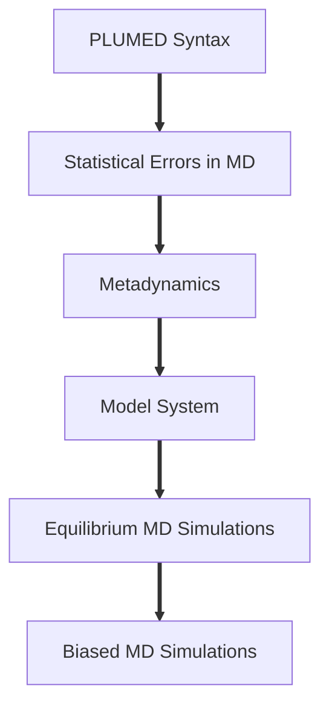

# MD Simulations of a NaCl Solution - Tutorials

This set of tutorials is used to familiarize computational chemistry students with running MD simulations to probe different properties of a NaCl solution under infinite dilution and perform enhanced sampling simulations to construct a free energy profile to explore the association and dissociation of the sodium and chloride ions. The tutorials mainly use the [Large-scale Atomic/Molecular Massively Parallel Simulator (LAMMPS)](https://docs.lammps.org/Manual.html) for the MD simulations and [PLUMED](https://www.plumed.org/) for post-processing and enhanced sampling simulations.

Before you start the tutorials, you will need to compile and install LAMMPS and PLUMED on your machine. Make sure that your LAMMPS is compiled with the interface to PLUMED:
- PLUMED installation: https://www.plumed.org/doc-v2.9/user-doc/html/_installation.html
- LAMMPS installation: https://docs.lammps.org/Install.html

Depending on your previous exposure to MD simulations and using PLUMED for post-processing and enhanced sampling simulations, you may look at the lessons on PLUMED syntax, statistical errors in MD simulations, and metadynamics offered by PLUMD.

